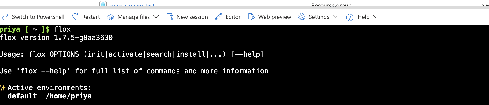
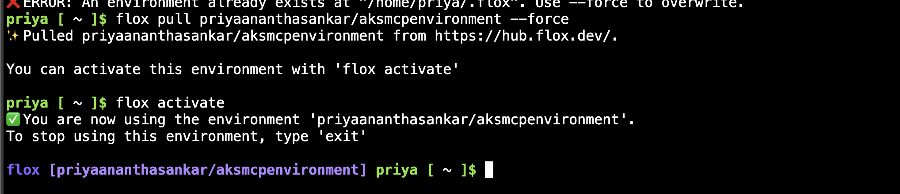
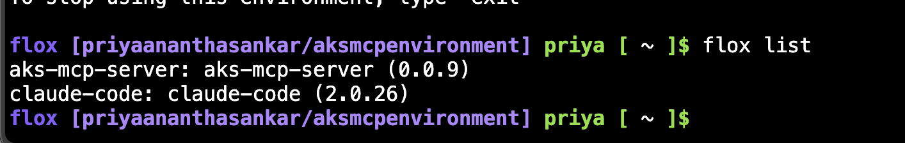
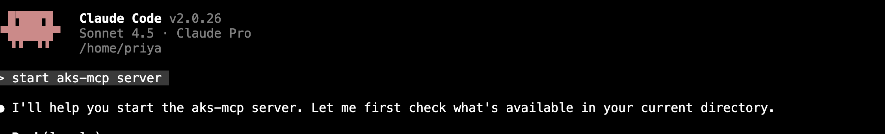
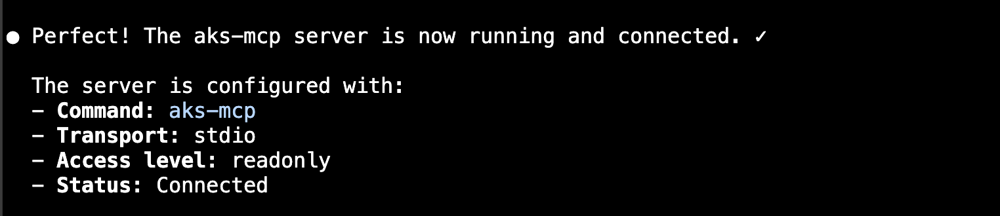
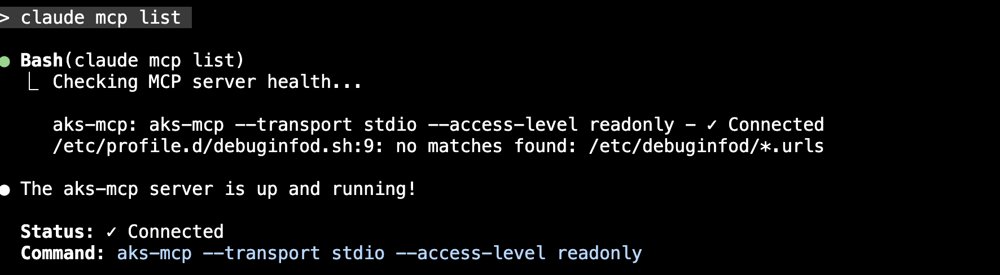
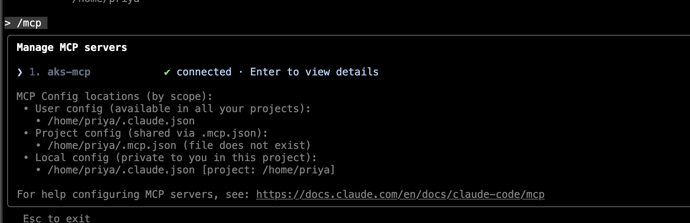
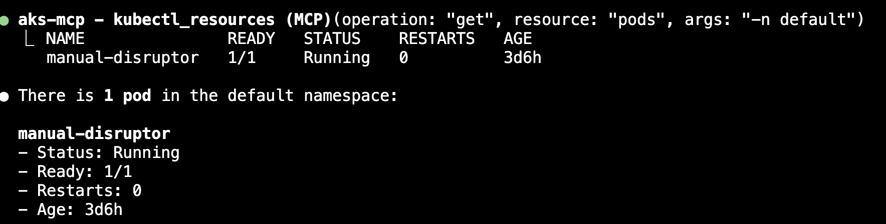

# Cloud Shell AKS Debugging Companion

Transform your Azure Cloud Shell into an intelligent debugging companion for Azure Kubernetes Service (AKS) using Flox environments, the aks-mcp-server, and Claude Code.

## Overview

This guide walks you through setting up a powerful debugging environment that combines:
- **Flox**: Declarative, reproducible development environments
- **aks-mcp-server**: Model Context Protocol server for AKS operations
- **Claude Code**: AI-powered coding assistant with MCP integration

## Prerequisites

- An Azure Subscription:
    - With access to Azure Cloud Shell
    - With access to AKS clusters 

## Setup Instructions

### Step 0: Install Flox in Cloud Shell

First, launch Azure Cloud Shell and.install Flox using the installation script:

1. Create the installation script:
```bash
curl -o install-flox.sh https://gist.githubusercontent.com/stealthybox/4511dcb77351e2636321aa860b5e3618/raw
```

2. Make it executable and run it in Cloud Shell terminal.
```bash
chmod +x install-flox.sh
./install-flox.sh
```

3. **Important**: Relaunch Cloud Shell



### Step 1: Pull the Flox Environment

Pull the pre-configured `aksmcpenvironment` from FloxHub:

```bash
flox pull priyaananthasankar/aksmcpenvironment --force
```

### Step 2: Activate the Environment

Activate the Flox environment:

```bash
flox activate
```

Your shell prompt should change to indicate the active environment.



### Step 3: Verify Installation

List the packages and tools included in the environment:

```bash
flox list
```



This will show you all the tools available in your debugging environment, including the aks-mcp-server and Claude Code.

#### Setup Claude MCP Config

`mkdir  .claude/mcp_config.json`

#### Add these lines to mcp_config.json

```
{
  "mcpServers": {
    "aks-mcp": {
      "command": "aks-mcp",
      "args": [
        "--transport", "stdio",
        "--access-level", "readonly"
      ],
      "env": {
        "AZURE_SUBSCRIPTION_ID": "<ENTER YOUR AZURE SUBSCRIPTION ID>"
      }
    }
  }
}
```

### Step 4: Launch Claude Code

Start Claude Code and authenticate:

```bash
claude
```

Follow the authentication prompts to sign in with your Anthropic account.

### Step 5: Connect to AKS MCP Server

Once Claude Code is running, instruct it to start the aks-mcp-server by saying:

`start aks mcp server using ~/.claude/mcp_config.json` 

**Note: Being explicit with the agent stops it from going all over the place figuring out how to start the MCP server**





Use `claude mcp list` to verify (or) `/mcp` to see if aks-mcp is connected, see below:



Now restart Claude 

**Note: This is Claude's requirement that it will load mcp tools only on restart**

Once restarted



Now you can use natural language. You will see MCP tools being run as seen below. The green dot on the left indicates it ran the tool successfully.


## Speak in natural language

`List all pods in default namespace`



## What You Can Do

With this setup, you can:

- **Query AKS clusters**: Ask Claude to list pods, services, deployments, etc.
- **Debug issues**: Get intelligent troubleshooting assistance for AKS problems
- **Analyze logs**: Have Claude help you parse and understand pod logs
- **Execute kubectl commands**: Claude can suggest and execute kubectl commands
- **Best practices**: Get recommendations for AKS configurations and deployments

## Example Queries

Try asking Claude:
- "Show me all pods in the default namespace"
- "What's wrong with my failing deployment?"
- "Check the logs for the nginx pod"
- "List all services across all namespaces"
- "Help me troubleshoot why my pod is in CrashLoopBackOff"

## Troubleshooting

### Flox not found after installation
Make sure you've relaunched your shell with `exec bash` or started a new Cloud Shell session.

### Authentication issues with Claude
Ensure you have a valid Anthropic account and API access. Check your network connectivity in Cloud Shell.

### MCP server connection issues
Verify that the aks-mcp-server is included in the environment by running `flox list`. If missing, try pulling the environment again.

## Additional Resources
- [AKS MCP](https://github.com/Azure/aks-mcp)
- [AKS MCP Nix Package PR](https://github.com/NixOS/nixpkgs/pull/443662)
- [AKS MCP Engineering Blog](https://blog.aks.azure.com/2025/08/20/real-time-observability-in-aks-mcp-server)
- [Flox Documentation](https://flox.dev/docs)
- [Model Context Protocol (MCP)](https://modelcontextprotocol.io/)
- [Azure AKS Documentation](https://learn.microsoft.com/en-us/azure/aks/)